# Purview Data Governance Field Guide

> **Disclaimer:** This material is provided as-is based on best efforts and may not be maintained to stay current with product updates. Please refer to the [DISCLAIMER](DISCLAIMER.md) for full terms.

This guide consolidates the key lessons on designing, governing, and securing a Microsoft Purview implementation. Use it as a quick reference when shaping your data map, onboarding sources, curating assets, and publishing governed data products.

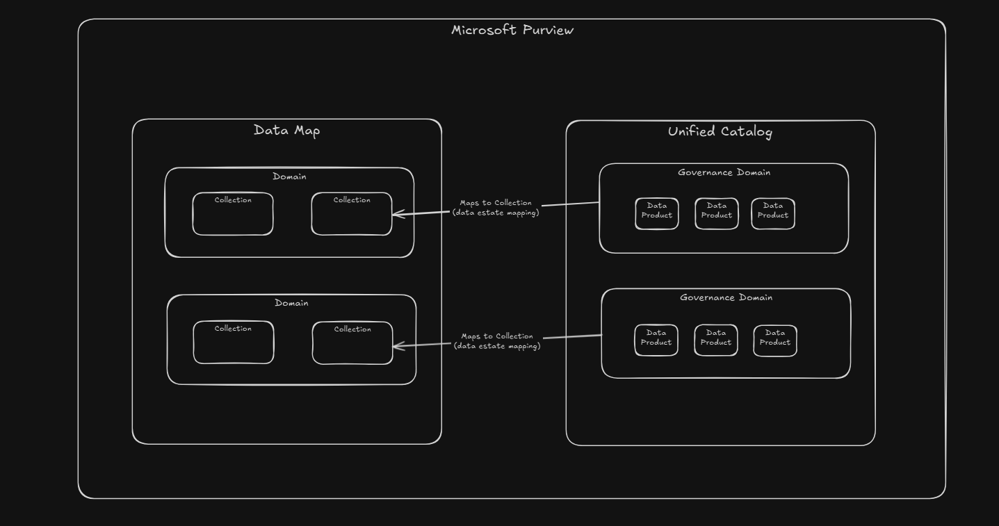

## Designing the Purview Data Map

- Model **platform domains** around business groupings(e.g., business units, product lines). Purview ships with a default domain and supports up to four additional custom domains; give each clear ownership and avoid overlapping responsibilities.
- Implement a **collections hierarchy** inside each domain to mirror teams, projects, or environments. RBAC assignments inherit down the tree, so design collections to minimise redundant permissions.
- Build a **sensitivity label taxonomy** that aligns to compliance policies. Purview can auto-apply labels during scans based on information-type detections, but focus manual curation on high-risk data.
- Enable **lineage connectors** (Data Factory, Synapse, SSIS, REST API) so stakeholders can trace sources, transformations, and downstream impact.

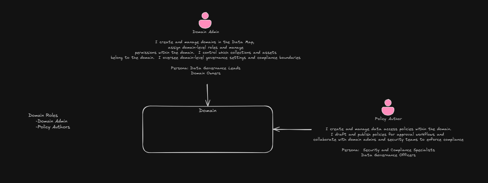

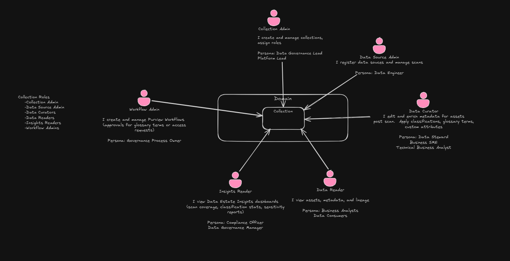

## Managing Data Sources

- **Register every source** you plan to scan. Registration captures metadata such as collection placement, friendly name, authentication method, and is a prerequisite for scans or policy enforcement.
- Configure **scan rule sets** to control scope, frequency, and classification behaviour. Use incremental scans where possible to reduce runtime and cost.
- Leverage **built-in classifications** and introduce **custom classifications** (regex or rules) for organisation-specific patterns. Review results after each scan and refine rules for coverage.
- Choose the right **integration runtime (IR)**: Azure IR for public Azure endpoints, managed VNet IR for private Azure networks, self-hosted IR for on-premises, and AWS IR for cross-cloud S3 scanning.

## Governance Domains and Glossary

- Create **governance domains** that align to business responsibilities and federated ownership. Domains anchor data products, policies, stewards, and accountability.
- Maintain an **enterprise glossary** with domain terms, definitions, stewards, synonyms, and relationships. Link terms to assets and products to improve search and shared understanding.
- Map governance domains to the data map collections so policy scoping and metadata inheritance remain consistent between operational hierarchy and business governance.

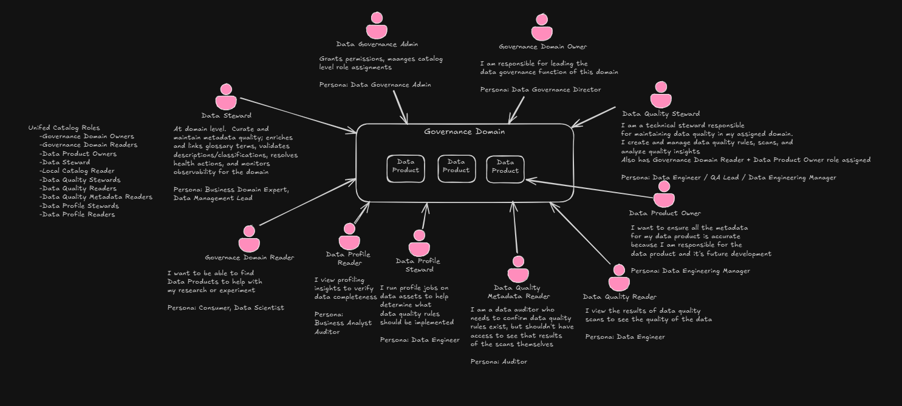

## Curating Data Assets

- Adopt a **federated curation model**: central teams run the platform, domain teams enrich assets with business context and quality indicators.
- Curation checklist:
  - Add clear business **descriptions**, usage guidance, and refresh cadence.
  - Assign **owners and stewards** for accountability.
  - **Link glossary terms** and maintain synonyms for discoverability.
  - Review and adjust **classifications, labels, lineage**, and quality status.
  - Mark promotion or certification state where applicable.
- Distinguish curated assets from raw ones so catalog consumers can quickly find trusted datasets.

## Data Products and Access

- Package curated assets into **data products** that answer specific business questions (e.g., Customer 360). Each product should include purpose, associated assets, glossary terms, quality signals, and OKRs.
- Treat products like living offerings: define target consumers, maintain ownership (product owner + steward), and track value with metrics.
- Implement **access policies** to control who can query underlying data. Policies complement Purview RBAC by enforcing read/create access at the source via Microsoft Purview access control.

## Access and Security Overview

- **Data map vs. unified catalog**: Data map domains and collections align to unified catalog governance domains and published data products. Maintaining this mapping keeps security and discovery in sync.
- **Domain roles**: Domain Admins oversee governance domains; Policy Authors draft and publish access policies in collaboration with security teams.
- **Collection roles**: Collection Admin, Data Source Admin, Data Curator, Data Reader, Insights Reader, and Workflow Admin inherit responsibilities for assets within a collection.
- **Unified catalog roles**: Governance Domain Owner/Reader, Data Product Owner, Data Steward, Local Catalog Reader, and specialised data quality/profile roles ensure curated content is discoverable yet controlled.
- **Personas highlighted**:
  - *Policy Author*: Security or governance specialists writing and managing data access policies.
  - *Workflow Admin*: Governance process owners managing approval workflows for glossary and access requests.
  - *Data Profile Steward*: Data engineers running profiling jobs to recommend data quality rules.
  - *Data Auditor*: Auditors verifying data quality controls exist without needing access to sensitive scan results.

- **Personas**:

  | AD Group | Scope | Role(s) | Persona | Notes/Responsibilities |
  |----------|-------|---------|---------|------------------------|
  | APP-PURVIEW-PURVIEW-ADMINS | Tenant | Purview Admins Role Group | Purview Administrator (or Data Governance Lead) Platform Admin | Will add users to role groups, create domains in the Data Map, create governance domains, assign roles to users. |
  | APP-DATA-GOVERNANCE-ADMINS | Tenant, Unified Catalog | Data Governance Admin + Governance Domain Owner (on all Governance Domains) | Data Governance Manager(s)/Leads Data Governance Admin | Grants permissions and manages catalog-level role assignments. |
  | APP-PURVIEW-PROD-DOMAIN-ADMIN | Data Map (AMC-Prod) | Domain Admin | Domain Governance Lead Data Governance Leads Domain Owners | I create and manage domains in the Data Map, assign domain-level roles and manage permissions within the domain. I control which collections and assets belong to the domain. I oversee domain-level governance settings and compliance boundaries. |
  | APP-PURVIEW-NONPROD-DOMAIN-ADMINS | Data Map (AMC-NonProd) | Domain Admin | Domain Governance Lead Data Governance Leads Domain Owners | I create and manage domains in the Data Map, assign domain-level roles and manage permissions within the domain. I control which collections and assets belong to the domain. I oversee domain-level governance settings and compliance boundaries. |
  | APP-PURVIEW-DATA-SOURCE-ADMIN (Central IT Scanning) | Tenant, Data Map | Data Source Admins (resource group) and Data Reader on specific collections | Data Engineering Team Data Engineer | Can be split by domain if necessary, but commonly this is one team across the organization. Connect to data sources and define/manage scans. View assets and data products (Data Reader). |
  | APP-PURVIEW-<COLLECTION>-COLLECTION-ADMINS | Data Map | Collection Admin | Data Governance Lead Platform Lead | I create and manage collections and assign roles. |
  | APP-PURVIEW-<COLLECTION>-WORKFLOW-ADMINS | Data Map | Workflow Admin | Governance Process Owner | I create and manage Purview workflows (approvals for glossary terms or access requests). |
  | APP-PURVIEW-<COLLECTION>-INSIGHTS-READERS | Data Map | Insights Reader | Compliance Officer Data Governance Manager | I view Data Estate Insights dashboards (scan coverage, classification stats, sensitivity reports). |
  | APP-PURVIEW-<COLLECTION>-DATA-READERS | Data Map | Data Reader | Data Consumers Business Analysts | I view assets, metadata, and lineage. |
  | APP-PURVIEW-<COLLECTION>-DATA-CURATORS | Data Map (Domain or Collection) | Data Curator | IT SME for Data Asset Data Steward Business SME Technical Business Analyst | Technical enrichment and catalog organization. Assign on specific collections for more granularity and security. I edit and enrich metadata for assets post-scan (apply classifications, glossary terms, custom attributes). |
  | APP-PURVIEW-<GOVERNANCE-DOMAIN>-DATA-STEWARD | Governance Domain | Data Steward | Business Domain Expert Data Management Lead | Data Steward roles in the Unified Catalog require corresponding Data Map permissions (at least reader on the collection) when adding or managing assets. In practice, a domain's stewards are often also made Data Curators or Readers on the Data Map for the sources in that domain. At the domain level they curate and maintain metadata quality, enrich and link glossary terms, validate descriptions/classifications, resolve health actions, and monitor observability for the domain. |
  | APP-PURVIEW-DATA-HEALTH-OWNERS | Governance Domain | Data Health Owner | The manager responsible for the data asset | Example: if there's an issue with database X, the person who manages database X. |
  | APP-PURVIEW-DATA-HEALTH-READERS | Governance Domain | Data Health Reader | Many | Anyone interested in data accuracy (data engineers, data scientists, etc.). |
  | (optional SPN) APP-PURVIEW-SPN-AUTOMATION | Data Map | Data Source Admin + Data Reader on needed branches | Automation Account |  |
  | APP-PURVIEW-<GOV DOMAIN NAME>-READER | Governance Domain | Governance Domain Reader | Data Scientist Consumer Business Analyst |  |
  | APP-PURVIEW-<GOV DOMAIN NAME>-DQM-READER | Governance Domain | Data Quality Metadata Reader | Auditor | Users who might review defined data quality rules and summary results (for awareness or audit) but not actively modify or execute them. I am a data auditor who needs to confirm data quality rules exist but shouldn't have access to see the results themselves. |
  | APP-PURVIEW-<GOV DOMAIN NAME>-DATA-QUALITY-STEWARDS | Governance Domain | Data Quality Steward | Data Engineer QA Lead Data Engineering Manager | I am a technical steward responsible for maintaining data quality in my assigned domain. I create and manage data quality rules, scans, and analyze quality insights. Also has Governance Domain Reader + Data Product Owner role assigned. |
  | APP-PURVIEW-<GOV DOMAIN NAME>-DATA-PRODUCT-OWNERS | Governance Domain | Data Product Owner | Data Engineering Manager | I want to ensure all the metadata for my data product is accurate because I am responsible for the data product and its future development. |
  | APP-PURVIEW-<GOV DOMAIN NAME>-DATA-QUALITY-READERS | Governance Domain | Data Quality Reader | Data Engineer | I view the results of data quality scans to see the quality of the data. |
  | APP-PURVIEW-<GOV DOMAIN NAME>-DATA-PROFILE-STEWARDS | Governance Domain | Data Profile Steward | Data Engineer | I run profile jobs on data assets to help determine what data quality rules should be implemented. |
  | APP-PURVIEW-<GOV DOMAIN NAME>-DATA-PROFILE-READERS | Governance Domain | Data Profile Reader | Business Analyst Auditor | I view profiling insights to verify data completeness. |
  

## How to Use This Guide

1. Start with the map: confirm domains, collections, and lineage connectors are in place.
2. Register sources, configure scans, and validate classifications before onboarding consumers.
3. Build and maintain the glossary alongside curation efforts so business vocabulary stays consistent.
4. Promote curated assets into data products and apply tailored access policies for each consumer group.
5. Revisit personas and role assignments regularly to ensure duties and permissions remain aligned as the data estate evolves.

## Setting up Purview Scanning App Registration for Fabric

### Setup

#### 1. Create App Registration 

Search for 'App Registration' in Azure Portal
Create New Registration

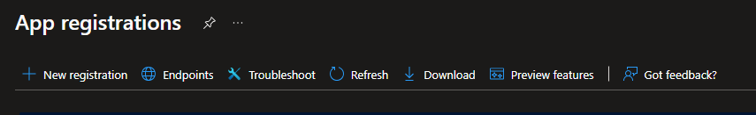

Assuming this will be done for a single AD/Entra Tenant, select Single tenant:

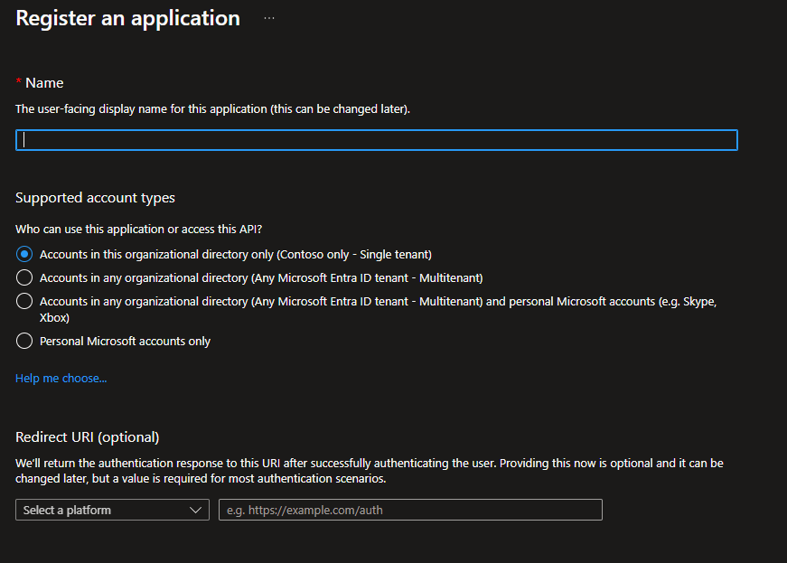

Redirect URI is not necessary

#### 2. Create an Azure Key Vault (This will be utilized to store the SPN secret when it is created)

#### 3. Navigate back to App Registrations and create a Client Secret

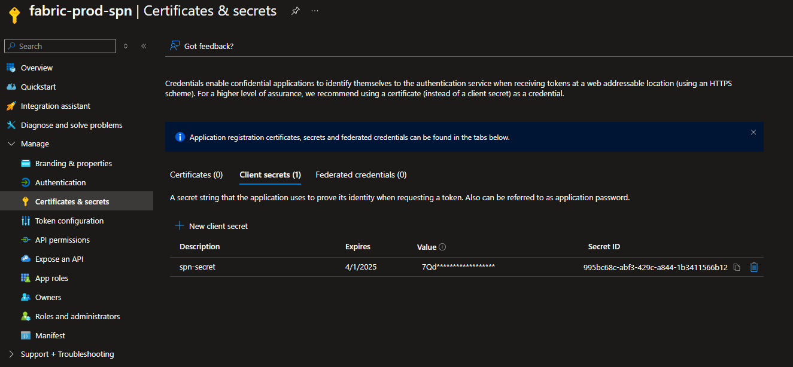
    

This client secret will be stored in the Azure Key Vault just created to retrieve the secret at runtime to get an oauth token to authenticate with the API Endpoints

Under API Permissions, add Tenant.Read.All from the Power BI Service:
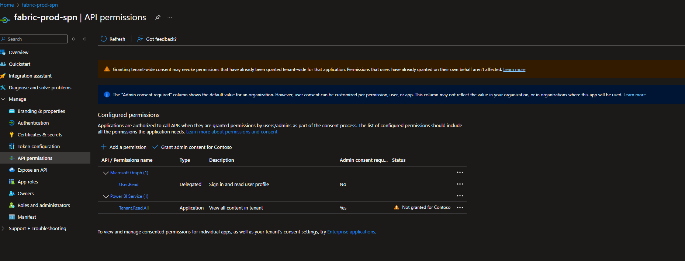

NOTE: Do not change Admin Consent Required to No as this will cause issues with the scanner endpoints

#### 4. Create Security Groups

Search for 'Microsoft Entra' in the Azure Portal and select Groups:

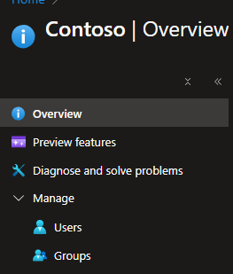

Create a new group of type 'Security' and add the SPN(s) created to the group:

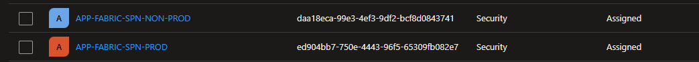

#### 5. Enable Power BI Tenant Settings
Navigate to the Power BI Admin Portal Tenant Settings

Enable 'Service principals can use Fabric APIs for Specific Security Groups and add the group(s) you created:

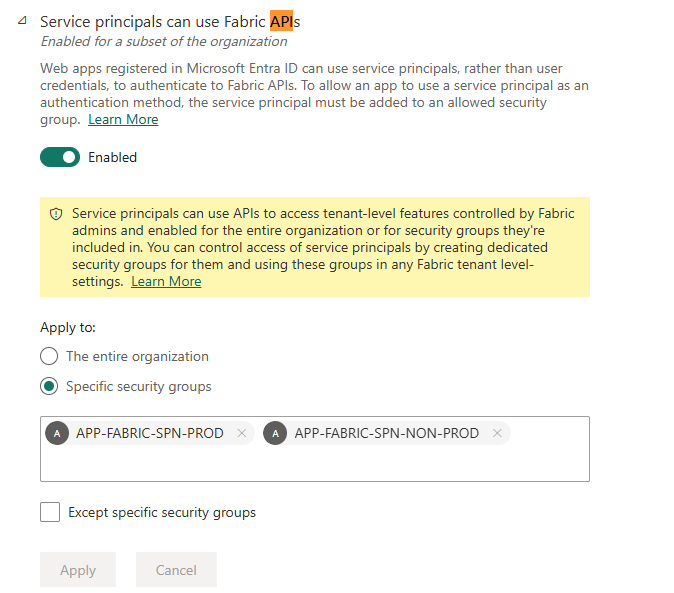

Do the same for 'Service principals can access read-only admin APIs', 'Enhance admin APIs responses with detailed mnetadata' and 'Enhance admin APIs responses with DAX and mashup expressions'

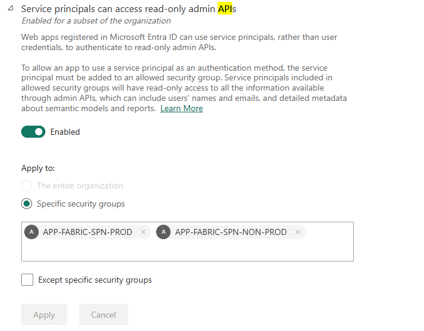

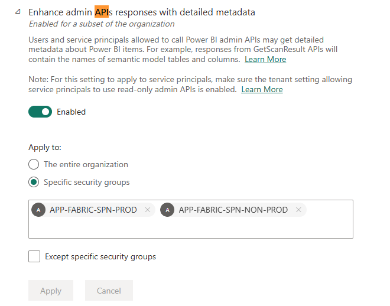

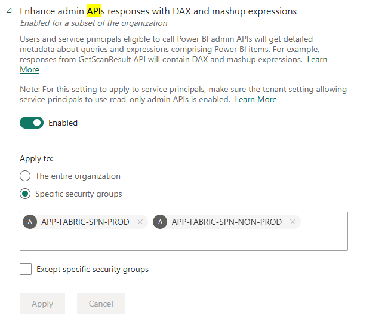

## Purview Data Map Best Practices

### Strategic vs. Operational Organization

- **Separate Strategy from Operations**: Domains are limited (only 5 allowed) and strategic, whereas Collections are operational. Leverage Collections for organizing resources, scans, and access boundaries.
- **Leverage Collection Depth**: Collections can go 8 levels deep - use this flexibility but prefer shallow, readable hierarchies (aim for 3-5 levels) unless granular control is required.

### Source and Scan Placement

- **Understand Source Limitations**: A data source can't be registered multiple times in the same Purview account. Land assets in subcollections for better delegation and organization.
- **Strategic Collection Placement**: Register sources under the appropriate domain/collection based on business ownership and operational needs.

### Naming Conventions

**Standardize Naming Patterns** using useful identifiers:
- **Environment**: prod, np, dev, test
- **Region**: eus2, wus2  
- **Zone**: raw, cur, gold (or bronze, silver, gold)
- **Domain/Business Unit**: fin, hr, mkt

**Collection Naming Format**: `<bu>-<env>-<domain>-<project>`
- Keep names unique to avoid confusion in deep trees
- Example: `fin-prod-analytics-customer360`

**Scan Naming Format**: `<env>-<source>-<scope>-<freq>-<ir>-<hhmm>`
- Example: `prd-adls-raw_daily-azureIR-0200`

### Scan Rule Sets

**Leverage Scan Rule Sets** to control scanning behavior:
- **System Scan Rule Sets**: Predefined by Microsoft, automatically updated, includes default classification rules
- **Custom Scan Rule Sets**: User-created for business-specific needs (e.g., scan only .csv or .parquet files)
- **Note**: Custom scan rule sets do not currently exist for Fabric

Scan rule sets determine:
- File types to include/exclude during scanning
- Which classification rules to apply (system or custom)
- Ignore patterns for files or folders
- Custom configurations for schema extraction and classification

### Scanning Best Practices

1. **Decide classification requirements** (system vs custom)
2. **Create or select scan rule sets** (include only what you need)
3. **Register the source** under the right domain/collection
4. **Choose credentials and integration runtime** type based on network needs
5. **Configure scan scope and schedule** appropriately

### Monitoring and Diagnostics

- **Enable Diagnostic Policies**: Ensure diagnostic policies are enabled on Purview to collect logs for debugging any issues that occur
- **Monitor Scan Performance**: Track scan duration, success rates, and resource consumption

