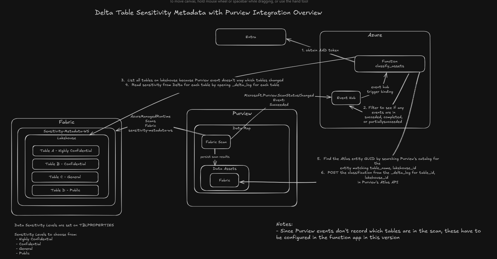

# Delta Table Sensitivity Metadata with Purview Integration — Overview

This solution is aimed at applying classifications to data in Fabric at the table level.  As of the time of this writing, a classification label can only exist at the lakehouse level.  However, it is common for several different levels of data classifications to exist within a lakehouse.  Therefore, this architecture shows a process to apply sensitivity attributes on TBLPROPERTIES of Delta Tables that can be picked up by a function app and applied as a classification in Purview.  This allows Data Governance Teams to understand the data that resides on each table.  Note that this does require someone to determine which data classification should be applied on the table in the first place, but once that is applied, it can be consumed into Purview for easier management and identification in one single location.  This classification and function app is triggered whenever there is a Succeeded, Completed, PartiallySucceeded Purview scan for Fabric.  These Purview events are emitted to an event hub and the function app has an input binding on this event hub and this triggers the app.  The app then filters for the event states previously mentioned, and then lists all tables on the lakehouse to find the sensitivity level applied to the TBLPROPERTIES.  Then, with this information, along with the table_id and lakehouse_id, the Atlas GUID for this table is searched for in Purview and if no classification is appled on the table, it is applied to Purview.  

### Options for Further Enhancement
- A means to have the lakehouse tables in the scan automatically detected for a function app to search these instead of the lakehouse having to be configured.

## What this diagram shows

1. Trigger:  Purview emits a ScanStatusLogEvent (diagnostic log) when a scan completes
2.  Diagnostic setting on Purview streams this to an Event Hub
3.  Function fires when it sees this log land
4. Filter:  If no event in the batch of logs has Status [Succeeded, Completed, PartiallySucceeded] nothing happens
5.  If it does, function app calls OneLake DFS API to list folders under <workspace>/<lakehouse>/Tables using the
functions Managed Identity token for storage.azure.com
6.  Operations for each table:
      - Read the _delta_log to get the table's data-sensitivity TBLPROPERTY (highly confidential, confidential, general, public)
      - Maps it to a classification catalog typedef name (like Sensitivity.HighlyConfidential)
      - Seaches Purview's catalog for the matching Atlas entity (by table name and lakehouse ID)
      - POSTs the classification onto the entity via Purview's Atlas API
         Example: POST /catalog/api/atlas/v2/entity/guid/{guid}/classifications
      - If classification label is already attached --> 400 returned as already classified
7. Logs a CLASSIFY_SUMMARY to app insights

## Components
Note that specific resources are called out here for easier reference in my subscription

### Entra
Microsoft Entra ID. Issues the AAD access tokens that the Function uses to
authenticate to every other service in the picture (storage, OneLake, Purview).
There are no service principals or secrets — the Function uses its
**system-assigned managed identity** and asks Entra for tokens via
`DefaultAzureCredential`.

### Azure
- **Function `classify_assets`** — Python Azure Function on Flex Consumption.
  Triggered by Event Hub binding. All outbound
  calls (Purview, OneLake, AAD) go through `requests` + `azure-identity`.
- **Event Hub** — `purview-scan-status` on namespace `ehns-fabricsens-rh`.
  Receives diagnostic-log rows pushed by the Purview account. The Function's
  EH listener pulls from this hub, claims partitions via blob ownership in
  the function's `AzureWebJobsStorage`, and checkpoints offsets after each
  successful batch.
- **`event hub trigger binding`** arrow — the Functions runtime owns this; it
  exposes the EH events as a `List[func.EventHubEvent]` argument to
  `classify_assets_impl`.

### Purview
- **Data Map** — Purview's catalog backbone (the Atlas-compatible graph store).
  Every discovered table, column, file and lineage edge lives here.
- **Fabric Scan** — a Purview scan definition that points at the
  `Sensitivity-Metadata-WS` Fabric workspace. When this scan runs, it
  enumerates assets in Fabric and writes/updates the corresponding entities
  in the Data Map.
- **Data Assets → Fabric** — the leaf node where the Atlas entities for the
  scanned Fabric objects live (Tables, Lakehouses, Workspaces, etc.). These
  are the entities the Function attaches `Sensitivity.*` classifications to.
- **`persist scan results`** arrow — internal Purview behavior; the scan
  populates Data Assets after running.

### Fabric
- **`Sensitivity-Metadata-WS`** — the Fabric workspace being governed.
- **Lakehouse** — a single lakehouse inside that workspace, configured via the
  Function's `SOURCE_WORKSPACE_ID` / `SOURCE_LAKEHOUSE_ID` /
  `SOURCE_LAKEHOUSE_NAME` env vars.
- **Tables A–D** — sample Delta tables, each tagged at the table level
  (`TBLPROPERTY data-sensitivity = ...`) with one of the four supported
  sensitivity levels: **Highly Confidential, Confidential, General, Public**.
  These are read straight from each table's `_delta_log` JSON.

## The numbered flow

The diagram uses six numbered annotations that map 1-to-1 onto
`classify_assets_impl` in `iac/function/classify_assets/handler.py`:

1. **Obtain AAD token** — Function asks Entra (via its managed identity) for
   tokens scoped to `https://storage.azure.com` (for OneLake reads) and
   `https://purview.azure.net` (for catalog calls). One token cache per
   resource, refreshed automatically by `DefaultAzureCredential`.
2. **Filter scan events** — `classify_assets_impl` flattens every
   `{"records": [...]}` envelope across the EH batch and checks whether
   **any** record has `properties.resultType` (or equivalent fields) in
   `{succeeded, completed, partiallysucceeded}`. If not → no-op and exit.
3. **List all tables in the lakehouse** — Purview scan events do **not** carry
   per-asset detail (`assetsDiscovered: 0` in the payload, no table names),
   so the Function calls the OneLake DFS API
   (`https://onelake.dfs.fabric.microsoft.com/{ws}?directory={lh}/Tables`) to
   enumerate every Delta table folder under `Tables/`. This is `_list_lakehouse_tables`.
4. **Read sensitivity from each Delta `_delta_log`** — for every table, the
   Function opens it via `deltalake.DeltaTable(abfss://...)` using its OneLake
   bearer token, reads the table metadata, and pulls the `data-sensitivity`
   key from `TBLPROPERTIES`. Tables without the property are skipped.
   This is `_read_sensitivity`.
5. **Find the Atlas entity GUID in Purview** — for each table that does have
   a sensitivity value, the Function POSTs to Purview's discovery search
   (`/datamap/api/search/query`) keyed on the table name, then narrows the
   hits to those whose `qualifiedName` contains the lakehouse ID. This is
   `_find_entity_guid`.
6. **POST the classification to Purview's Atlas API** — the Function maps the
   sensitivity value through `SENSITIVITY_LEVEL_MAP_JSON` (e.g.
   `highly confidential → HighlyConfidential`) to a typedef name like
   `Sensitivity.HighlyConfidential`, then POSTs it onto the entity at
   `/catalog/api/atlas/v2/entity/guid/{guid}/classifications`. The call is
   idempotent — a 400 with "already associated with classification" is
   detected and treated as a no-op. This is `_classify`.

## How a single end-to-end cycle plays out

1. A scheduled or manual **AzureManagedRuntime scan** runs against
   `Sensitivity-Metadata-WS` and writes/updates entries in **Data Assets**.
2. Purview emits a **`Microsoft.Purview.ScanStatusChanged` (Succeeded)**
   diagnostic log row.
3. Purview's diagnostic settings stream that row to the **Event Hub**.
4. The Function's EH listener pulls the batch and invokes
   `classify_assets_impl(events)`.
5. The function filters → lists tables → reads each Delta log → searches
   Purview for the matching entity → POSTs the classification.
6. A `CLASSIFY_SUMMARY {...}` line is logged to Application Insights with
   counts (`total / classified / skipped_no_property / skipped_no_entity / errors`).

## Notes

- **Data Sensitivity Levels are set on TBLPROPERTIES.** The four allowed
  values are **Highly Confidential, Confidential, General, Public**, mapped
  to typedef suffixes via the `SENSITIVITY_LEVEL_MAP_JSON` env var.
- **Purview events don't record which tables are in the scan**, so the
  workspace + lakehouse to walk is hard-coded in this version via the
  Function App's `SOURCE_WORKSPACE_ID`, `SOURCE_LAKEHOUSE_ID`, and
  `SOURCE_LAKEHOUSE_NAME` settings. A full re-pass on every successful scan
  is the correct behaviour because (a) the event carries no per-asset detail
  and (b) `TBLPROPERTIES` can change at any time outside of a scan; the
  per-table classify call is idempotent so the cost is bounded by the table
  count of the lakehouse.
